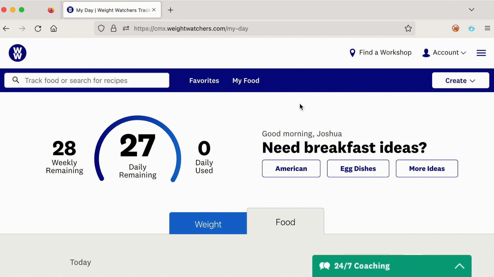

# [OPTIONAL] Authenticating with JWT

If you don't want to specify your username and password to access your Weight Watchers API data, you can alternatively authenticate using a Java Web Token (JWT).
The weightwatchers.com website uses a JWT when you authenticate using your browser, making this an opportunity to give `wwtracked.py` temporary access by supplying the JWT with the `-J` argument, but without needing to enter your password into the `wwtracked.py` script.

> NOTE: This is optional.
> You can login to get your Weight Watchers tracking data using the `-E` argument and your email address.
> You only need to supply the JWT if you don't want to supply your password to the `wwtracked.py` script.


## Getting the JWT

To get the JWT you can use Firefox and the browser tools:

* From Firefox, navigate to the [www.weightwatchers.com](https://www.weightwatchers.com) website and login
* Right-click in the browser window and select Inspect
* Navigate to the Network tab at the top of the inspector window
* Click the Refresh button to record network information
* Click on any network request for https://cmx.weightwatchers.com (click in the Domain column)
* Scroll to the section labeled _Request Headers_
* Right-click the Authorization header and select _Copy Value_; this will place the JWT value in your clipboard

Here's an example:




## Using the JWT

You can specify the JWT on the command line using `-J`:

```
$ python wwtracked.py -s 2022-12-20 -e 2022-12-30 -J "Bearer eyJ0eX...zqdVwoQ"
```

> Note: When pasting the JWT, you can omit the `Bearer ` prefix or include it.
> If you include the `Bearer ` prefix, make sure you paste the entire string inside quotation marks, as shown above.
